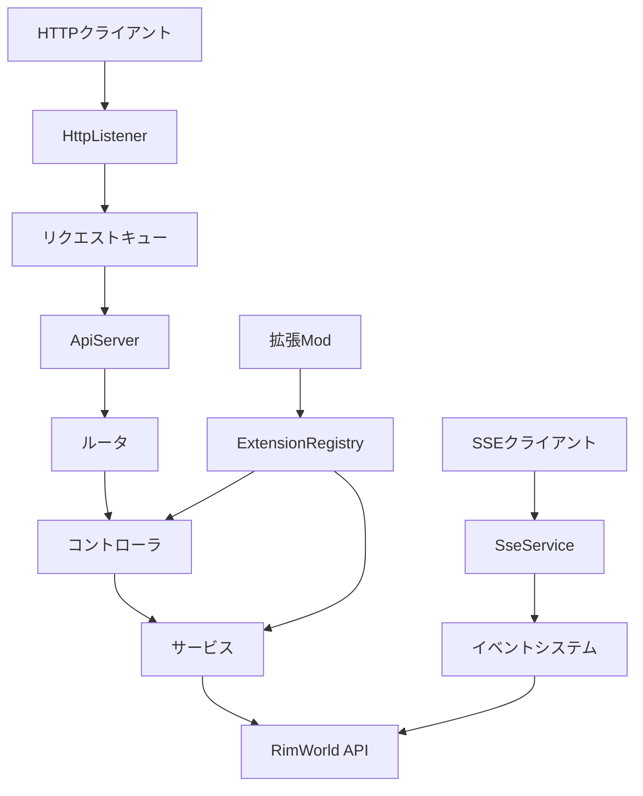
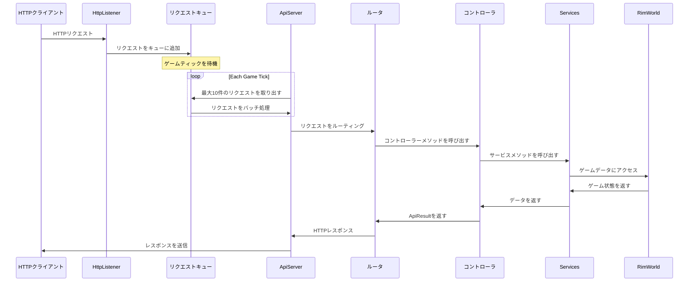
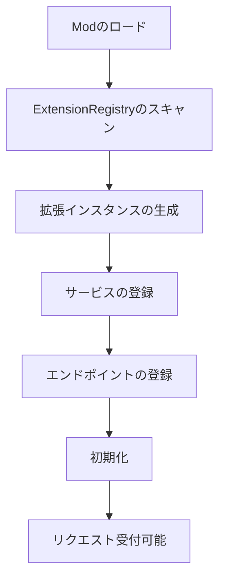

# RIMAPI アーキテクチャガイド

このドキュメントは、RIMAPIのアーキテクチャの包括的な概要を提供し、Mod開発者がシステムの仕組みと効果的な拡張方法について理解できるよう設計されています。

## コアアーキテクチャの原則

RIMAPIはいくつかの重要な設計原則に基づいて構築されています。

- **メインスレッドの安全性**: ゲームの不安定化を防ぐため、すべてのHTTP処理はキューイングを通じてRimWorldのメインスレッド上で行われます。
- **拡張性優先**: コアは明確に定義された拡張システムを通じて他のModから拡張できるよう設計されています。
- **独立性**:コンポーネントは関心ごとに分離され、インターフェースを通じて通信します。
- **エラーの隔離**:壊れた拡張機能がコアAPIや他の拡張機能に影響を与えないようにします。

## システム概要

## コアコンポーネント

### ApiServer

HTTPサーバーおよびリクエスト処理のライフサイクルを管理する中心的なコンポーネントです。

- **主な責務**:  HTTPリスナーの管理、リクエストキューの処理、ライフサイクル管理。
- **スレッド処理**: I/Oにはasync/awaitを使用しますが、ティック中はメインスレッドでリクエストを処理します。
- **設定**: ポートバインディング、リクエストスロットリング（10リクエスト/ティック）、CORS処理。

### DIコンテナ

サービスのライフタイムと依存関係を管理する、カスタムビルドのDI（依存性注入）システムです。

- **ServiceCollection**: サービスを登録するためのコンテナ。シングルトン（Singleton）やトランジェント（Transient）などのライフタイムを指定できます。
- **ServiceProvider**:コンストラクタインジェクションを通じて依存関係を解決します。
- **ライフタイム**:
  - **Singleton（シングルトン）**: アプリケーション全体で一つのインスタンス（例: ApiServer、SseService）
  - **Transient（トランジェント）**: 解決のたびに新しいインスタンス（例: ほとんどのコントローラー）

### ルータ

HTTPリクエストを適切なコントローラーメソッドへルーティングします。

- **属性ベース**: ルート探索に[Get]、[Post]、[Put]、[Delete]属性を使用します。
- **自動登録**: コントローラールートを自動的にスキャンして登録します。
- **パターンマッチング**: ルートパラメーターとパターンマッチングをサポートします。
- **拡張名前空間**: Mod間のルート競合を防ぎます。

### SseService

リアルタイムのゲーム更新のためのSSE（Server-Sent Events）を管理します。

- **接続管理**: アクティブなSSE接続を追跡します。
- **イベントブロードキャスト**: ゲームイベントをすべての接続クライアントに配信します。
- **ハートビート**: 接続を維持するため、定期的に keep-aliveメッセージを送信します。
- **拡張サポート**: 他のModがカスタムイベントを公開できます。

## リクエストライフサイクル

## 拡張システムのアーキテクチャ

拡張システムにより、他のModがRIMAPIとシームレスに統合できます。

### IRimApiExtension インターフェース

    public interface IRimApiExtension
    {
        string Name { get; }
        string Version { get; }
        void RegisterServices(IServiceCollection services);
        void RegisterEndpoints(IEndpointRouteBuilder routeBuilder);
        void Initialize(IServiceProvider serviceProvider);
    }

### 拡張機能の検出

- **反射スキャン**: IRimApiExtensionを実装する型を自動的に検出します。
- **独立した登録**: 各拡張機能が独自のサービスとルートを登録します。
- **エラーハンドリング**: 一つの拡張機能の失敗が他に影響しません。

### 拡張機能のライフタイム

## サービスレイヤーのアーキテクチャ

サービスレイヤーはRimWorldの内部APIを抽象化し、クリーンでテスト可能なインターフェースを提供します。

### 現在のサービス構成

!!! 内部サービス
    - **ISseService**: リアルタイムイベント管理
    - **IExtensionRegistry**: 拡張機能の検出と管理
    - **IDocumentationService**: APIドキュメント生成

!!! ゲームサービス
    - **IGameStateService**: ゲームモード、ストーリーテラー、難易度などのコア情報
    - **IColonistService**: ポーン／入植者の管理と状態
    - **IMapService**: マップ情報、地形、オブジェクト
    - **IResourceService**: アイテム、インベントリ、資源管理
    - **IResearchService**: 研究の進捗と技術
    - **IIncidentService**: イベント、クエスト、インシデント

## データフローのパターン

### REST API フロー

    HTTPリクエスト → ルータ → コントローラ → サービス → RimWorld API → DTO → JSONレスポンス

### SSE イベントフロー

    ゲームフック → イベントアグリゲーター → SseService → SSEクライアント
    拡張イベント → イベントアグリゲーター → SseService → SSEクライアント

### 拡張統合フロー

    拡張Mod → IRimApiExtension → ServiceCollection → ルーター → APIで利用可能

## エラーハンドリング戦略

- **グローバル例外ハンドリング**: すべての例外をキャッチし、標準化されたエラーレスポンスに変換します。
- **拡張の隔離**: 拡張メソッドの呼び出しをtry-catchブロックで囲みます。
- **リクエストタイムアウト保護**: ハングアップを防ぐためリクエストごとの最大処理時間を設定します。
- **サーキットブレーカーパターン**: 繰り返し失敗する拡張機能は一時的に無効化される場合があります。

## パフォーマンスに関する考慮事項

!!! 開発中
    - **リクエストスロットリング**: 処理をゲームティックあたり10リクエストに制限します。
    - **遅延初期化**: 重いリソースは初回使用時に初期化します。
    - **DTO最適化**: データ転送オブジェクトによる直列化のオーバーヘッドを削減します。
    - **SSEバッチング**: 複数のイベントを一つのメッセージにまとめる場合があります。
    - **接続プーリング**: SSE接続を効率的に管理します。

## Mod統合ポイント

拡張機能は複数のレベルで統合できます。

- **サービスレイヤー**: DIを通じて新しいビジネスロジックサービスを追加。
- **コントローラーレイヤー**: 自動ルーティングで新しいRESTエンドポイントを追加。
- **イベントレイヤー**: カスタムSSEイベントを公開。

## 次のステップ

- [初めての拡張機能の作成](../developer_guide/creating_extensions.md)を学ぶ
- [新しいエンドポイントの追加](../contributors_guide/creating_endpoints.md)を学ぶ
- [自動生成されたAPIリファレンス](../api.md)を確認する
