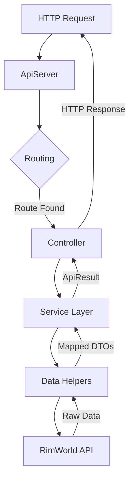

# エンドポイントの作成

このガイドでは、RIMAPIでREST APIのエンドポイントを作成する方法を説明します。コントローラーからサービス層まで、新しいエンドポイント構築のパターンを学べます。

## アーキテクチャの概要

RIMAPIは、HTTPリクエストを扱うためのレイヤードアーキテクチャを採用しています。このフローを理解することが、効果的に貢献するための鍵です。



1.  **ApiServer**: 軽量なHTTPサーバーが着信リクエストを待ち受けます。
2.  **Routing**: サーバーはリクエストのパスとHTTPメソッドを、`[Get("/path")]` や `[Post("/path")]` 属性で装飾されたコントローラーアクションにマッチさせます。
3.  **Controller**: コントローラーアクションがエンドポイントの入り口です。リクエストパラメータを解析し、適切なサービスを呼び出してJSONレスポンスを返します。
4.  **Service Layer**: コアのビジネスロジックがここに置かれます。データ取得や操作を調整し、しばしば1つ以上のデータヘルパーを呼び出します。
5.  **Data Helpers**: ヘルパーはRimWorld API（`Verse`や`RimWorld`名前空間）との直接的なやり取りをカプセル化し、生のゲームデータを取得します。
6.  **DTOマッピング**: ヘルパーやサービスは生のゲームデータをData Transfer Object（DTO）にマッピングします。これにより、ゲーム内部のデータ構造とAPIの公開契約をクリーンに分離できます。
7.  **ApiResult**: サービス層はDTOを標準化された`ApiResult<T>`オブジェクトでラップします。`success`、`errors`、`warnings`などのステータス情報を含みます。
8.  **HTTPレスポンス**: コントローラーは`ApiResult`をJSON文字列にシリアライズしてクライアントに返します。

## 手順: 新しいエンドポイントを作る

ここでは `GET /api/v1/example` エンドポイントを作成する例を示します。

### 1. DTOを定義する

まず、エンドポイントが返すデータを表すDTOを定義します。`Source/RIMAPI/RimworldRestApi/Models/` の適切なファイルに新しいクラスを作成してください。

**`Source/RIMAPI/RimworldRestApi/Models/ExampleDto.cs`**
```csharp
namespace RIMAPI.Models
{
    public class ExampleDto
    {
        public string Message { get; set; }
        public bool IsExample { get; set; }
    }
}
```

### 2. サービスインターフェイスを作成する

サービスの契約を `Source/RIMAPI/RimworldRestApi/Services/` ディレクトリに定義します。

**`Source/RIMAPI/RimworldRestApi/Services/IExampleService.cs`**
```csharp
using RIMAPI.Core;
using RIMAPI.Models;

namespace RIMAPI.Services
{
    public interface IExampleService
    {
        ApiResult<ExampleDto> GetExampleMessage();
    }
}
```

### 3. サービスを実装する

サービスの具体的な実装を作成します。ビジネスロジックはここに置きます。

**`Source/RIMAPI/RimworldRestApi/Services/ExampleService.cs`**
```csharp
using RIMAPI.Core;
using RIMAPI.Models;

namespace RIMAPI.Services
{
    public class ExampleService : IExampleService
    {
        public ApiResult<ExampleDto> GetExampleMessage()
        {
            // 実際のケースでは、ヘルパーを呼び出してRimWorldのデータを取得します。
            var exampleData = new ExampleDto
            {
                Message = "This is a test from the service layer!",
                IsExample = true
            };
            
            return ApiResult<ExampleDto>.Ok(exampleData);
        }
    }
}
```

### 4. コントローラーを作成する

サービスロジックをHTTPエンドポイントとして公開するコントローラーを作成します。`Source/RIMAPI/RimworldRestApi/BaseControllers/` に配置してください。

**`Source/RIMAPI/RimworldRestApi/BaseControllers/ExampleController.cs`**
```csharp
using System.Net;
using System.Threading.Tasks;
using RIMAPI.Core;
using RIMAPI.Http;
using RIMAPI.Services;

namespace RIMAPI.Controllers
{
    public class ExampleController : BaseController
    {
        private readonly IExampleService _exampleService;

        public ExampleController(IExampleService exampleService)
        {
            _exampleService = exampleService;
        }

        [Get("/api/v1/example")]
        [EndpointMetadata("An example endpoint to demonstrate functionality.")]
        public async Task GetExample(HttpListenerContext context)
        {
            var result = _exampleService.GetExampleMessage();
            await context.SendJsonResponse(result);
        }
    }
}
```

### 5. DIコンテナにサービスを登録する

`ExampleController` が `IExampleService` のインスタンスを受け取れるよう、依存性注入コンテナに登録します。

`Source/RIMAPI/RIMAPI_Mod.cs` の `ConfigureServices` メソッドを開き、サービスを追加してください:

```csharp
private void ConfigureServices(IServiceCollection services)
{
    // ... 他のサービス
    services.AddSingleton<IExampleService, ExampleService>();
    // ... 他のサービス
}
```

### 6. エンドポイントをドキュメント化する

最後に、`docs/_endpoints_examples/examples.yml` に新しいエンドポイントのエントリを追加してください。これによりAPIドキュメントに表示されます。

```yaml
    "/api/v1/example":
        desc: |
            An example endpoint that returns a sample message.
        curl: |
            **Example:**
            ```bash
            curl --request GET \
            --url 'http://localhost:8765/api/v1/example'
            ```
        request: ""
        response: |
            **Response:**
            ```json
            {
                "success": true,
                "data": {
                    "Message": "This is a test from the service layer!",
                    "IsExample": true
                },
                "errors": [],
                "warnings": [],
                "timestamp": "2025-12-12T12:00:00.0000000Z"
            }
            ```
```

## 上級トピック

### リクエストデータの扱い

#### クエリパラメータ

`RequestParser` を使ってURLから安全にパラメータを取り出してください。

```csharp
[Get("/api/v1/colonist")]
public async Task GetColonist(HttpListenerContext context)
{
    var pawnId = RequestParser.GetIntParameter(context, "id");
    var result = _colonistService.GetColonist(pawnId);
    await context.SendJsonResponse(result);
}
```

#### POSTリクエストのJSONボディ

`[Post]` エンドポイントでは、リクエストボディを読み取ってDTOにデシリアライズできます。

```csharp
[Post("/api/v1/colonist/work-priority")]
public async Task SetColonistWorkPriority(HttpListenerContext context)
{
    var body = await context.Request.ReadBodyAsync<WorkPriorityRequestDto>();
    var result = _colonistService.SetColonistWorkPriority(body);
    await context.SendJsonResponse(result);
}
```

### レスポンスのキャッシュ

頻繁に変わらないデータには `ICachingService` を使ってパフォーマンスを向上させてください。

```csharp
[Get("/api/v1/colonists")]
public async Task GetColonists(HttpListenerContext context)
{
    await _cachingService.CacheAwareResponseAsync(
        context,
        key: "/api/v1/colonists",
        dataFactory: () => Task.FromResult(_colonistService.GetColonists()),
        expiration: TimeSpan.FromSeconds(30)
    );
}
```

## エンドポイントのテスト

エンドポイントをビルドしたら、[Hoppscotch](https://hoppscotch.io/)、[Postman](https://www.postman.com/)、または `curl` などのツールでテストできます。

```bash
# クエリパラメータつきの例
curl "http://localhost:8765/api/v1/colonist?id=1020"

# POSTリクエストとJSONボディの例
curl --request POST \
  --url http://localhost:8765/api/v1/colonist/work-priority \
  --header 'Content-Type: application/json' \
  --data '{ 
    "id": 1020, 
    "work": "Cooking", 
    "priority": 1 
  }'
```

## 次のステップ
- 既存のコントローラーとサービスを調べて、さらなる例を参照してください。
- 自動生成されたAPIリファレンス（`../api.md`）を確認して既存のエンドポイントを確認してください。
