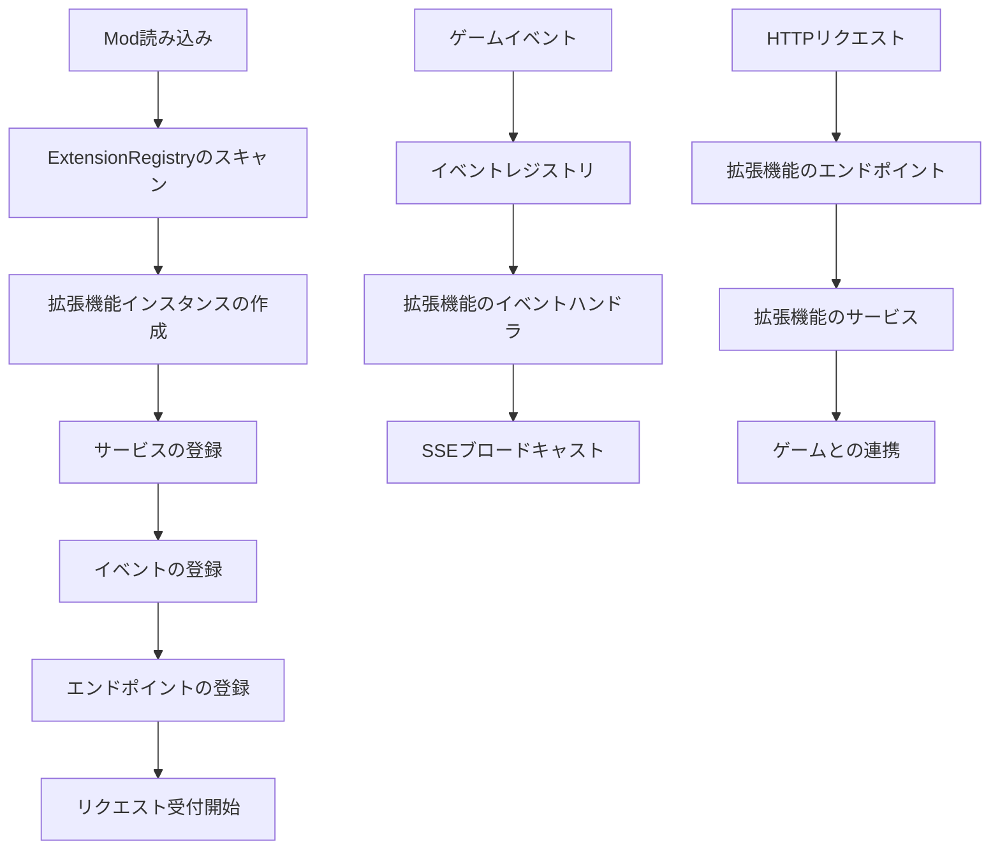

# RIMAPI拡張機能の作成

このガイドでは、RIMAPI拡張機能（Extension）を作成してAPIにカスタム機能、エンドポイント、イベントを追加する方法を解説します。拡張機能を使うと、コアシステムを変更することなく、他のModがRIMAPIとシームレスに連携できます。

## 拡張機能のアーキテクチャ概要

拡張機能はRIMAPIによって自動検出され、APIライフサイクルに組み込まれます。



## 拡張機能の基本構造

### コアインターフェース

すべての拡張機能は `IRimApiExtension` を実装する必要があります。

```csharp
    public interface IRimApiExtension
    {
        string ExtensionId { get; }
        string ExtensionName { get; }
        string Version { get; }

        void RegisterServices(IServiceCollection services);
        void RegisterEvents(IEventRegistry eventRegistry);
        void RegisterEndpoints(IExtensionRouter router);
    }
```

### 最小構成の拡張機能例

TBE

## 拡張機能の検出

RIMAPIは、`IRimApiExtension` を実装した型を読み込み済みのすべてのアセンブリからスキャンすることで、拡張機能を自動検出します。

検出プロセスの概要：
- RIMAPIの初期化時に自動で実行される
- 読み込まれているすべてのRimWorld Modのアセンブリをスキャンする
- 見つかった拡張機能のインスタンスを作成する
- エラーを隔離 — 壊れた拡張機能が他に影響しない
- 検出されたすべての拡張機能をデバッグ用にログに記録する

## サービスの登録

### 拡張機能における依存性注入

拡張機能はRIMAPIのDIコンテナを利用して独自のサービスを登録できます。

```csharp
    public void RegisterServices(IServiceCollection services)
    {
        // シングルトン — アプリケーション全体で1インスタンス
        services.AddSingleton<IMyConfigService, MyConfigService>();

        // トランジェント — 解決のたびに新しいインスタンス
        services.AddTransient<IMyExampleController, IMyExampleController>();
    }
```

### サービスのライフタイム指針

| ライフタイム | 用途 | 例 |
| --- | --- | --- |
| **Singleton** | 設定、共有状態、イベントパブリッシャー | `MyConfigService`、`EventAggregator` |
| **Transient** | ビジネスロジック、ステートレスサービス、リクエストハンドラ | `DataProcessor`、`ValidationService` |

### RIMAPIコアサービスへのアクセス

拡張機能は依存性注入を通じてRIMAPIのコアサービスを利用できます。

```csharp
    public class MyService : IMyService
    {
        private readonly ISseService _sseService;
        private readonly IGameStateService _gameState;

        public MyService(ISseService sseService, IGameStateService gameState)
        {
            _sseService = sseService;
            _gameState = gameState;
        }

        public void DoSomething()
        {
            // RIMAPIコアサービスを利用する
            var gameMode = _gameState.GetGameMode();
            _sseService.PublishEvent("my-extension.action-completed", new { result = "success" });
        }
    }
```

## イベントシステムとの連携

### カスタムイベントの登録

拡張機能は独自のSSEイベントを定義して発行できます。

```csharp
    public void RegisterEvents(IEventRegistry eventRegistry)
    {
        // カスタムイベントを登録する
        eventRegistry.RegisterEvent("my-extension.item-crafted");
        eventRegistry.RegisterEvent("my-extension.quest-completed");
        eventRegistry.RegisterEvent("my-extension.error-occurred");
    }
```

### イベントの発行

`IEventPublisher` を使ってSSEクライアントへイベントをブロードキャストします。

```csharp
    public class MyCraftingService
    {
        private readonly IEventPublisher _eventPublisher;

        public MyCraftingService(IEventPublisher eventPublisher)
        {
            _eventPublisher = eventPublisher;
        }

        public void OnItemCrafted(Thing item, Pawn crafter)
        {
            _eventPublisher.Publish("my-extension.item-crafted", new
            {
                itemId = item.ThingID,
                itemName = item.Label,
                crafterName = crafter.Name.ToString(),
                crafterId = crafter.Id.ToString(),
                timestamp = DateTime.UtcNow
            });
        }
    }
```

### ゲームイベントの監視

拡張機能はRimWorldのイベントにフックしてSSEイベントとして発行できます。

```csharp
    public class MyGameEventService
    {
        private readonly IEventPublisher _eventPublisher;

        public MyGameEventService(IEventPublisher eventPublisher)
        {
            _eventPublisher = eventPublisher;
        }

        public void Initialize()
        {
            // RimWorldのイベントにフックする
            Find.TickManager.TickManagerTick += OnGameTick;
            Find.Storyteller.incidentQueue.IncidentQueueTick += OnIncidentQueued;
        }

        private void OnGameTick()
        {
            // 定期的なイベントを発行する
            if (Find.TickManager.TicksGame % 60 == 0) // 60ティックごと
            {
                _eventPublisher.Publish("my-extension.game-tick", new
                {
                    tick = Find.TickManager.TicksGame,
                    time = DateTime.UtcNow
                });
            }
        }
    }
```

## エンドポイントの登録

TBE

### コントローラーベースのエンドポイント

複雑なAPIには、自動ルーティング付きのコントローラークラスを使います。

```csharp
    // コントローラーは自動検出されてルーティングされる
    public class ItemsController
    {
        private readonly IItemsService _itemsService;

        public ItemsController(IItemsService itemsService)
        {
            _itemsService = itemsService;
        }

        [Get("/item")]
        public ApiResult<ItemDto> GetByItemId(string id)
        {
            var item = _itemsService.GetItem(id);
            if (item == null)
                return ApiResult.NotFound($"Item {id} not found");

            return ApiResult.Success(item);
        }
    }
```

### 拡張機能の名前空間

すべての拡張機能のエンドポイントは、競合を防ぐために自動で名前空間が付与されます。

???+ warning
    拡張機能で登録したパス: `/items`

    実際のアクセスパス: `/api/extensions/your-extension-id/items`

    URLの例:

    **GET** `/api/extensions/my-crafting-mod/items`

    **POST** `/api/extensions/my-crafting-mod/items`

    **GET** `/api/extensions/my-crafting-mod/items/123`

## 完全な例：拡張機能の作成

### 拡張機能の定義

```csharp
    public class CraftingExtension : IRimApiExtension
    {
        public string ExtensionId => "crafting-mod";
        public string ExtensionName => "Advanced Crafting API";
        public string Version => "1.0.0";

        public void RegisterServices(IServiceCollection services)
        {
            services.AddSingleton<ICraftingService, CraftingService>();
            services.AddSingleton<ICraftingEventService, CraftingEventService>();
            services.AddTransient<IRecipeService, RecipeService>();
        }

        public void RegisterEvents(IEventRegistry eventRegistry)
        {
            eventRegistry.RegisterEvent("crafting.recipe-started");
            eventRegistry.RegisterEvent("crafting.recipe-completed");
            eventRegistry.RegisterEvent("crafting.recipe-failed");
            eventRegistry.RegisterEvent("crafting.materials-low");
        }

        public void RegisterEndpoints(IExtensionRouter router)
        {
            // 手動によるエンドポイント登録
            router.MapGet("/recipes", () => GetRecipes());
            router.MapPost("/recipes/{defName}/craft", (string defName) => StartCrafting(defName));

            // コントローラーベースのエンドポイントは自動検出される
        }
    }
```

### サポートサービス

```csharp
    public class CraftingService : ICraftingService
    {
        private readonly IEventPublisher _eventPublisher;
        private readonly IGameStateService _gameState;

        public CraftingService(IEventPublisher eventPublisher, IGameStateService gameState)
        {
            _eventPublisher = eventPublisher;
            _gameState = gameState;
        }

        public bool StartCrafting(string recipeDefName, string colonistId = null)
        {
            try
            {
                // 実装ロジックをここに記述
                _eventPublisher.Publish("crafting.recipe-started", new
                {
                    recipe = recipeDefName,
                    colonist = colonistId,
                    timestamp = DateTime.UtcNow
                });

                return true;
            }
            catch (Exception ex)
            {
                _eventPublisher.Publish("crafting.recipe-failed", new
                {
                    recipe = recipeDefName,
                    error = ex.Message,
                    timestamp = DateTime.UtcNow
                });

                return false;
            }
        }
    }
```

## エラー処理と分離

### 拡張機能のエラー分離

RIMAPIは、壊れた拡張機能が他に影響しないよう、エラー分離機能を提供しています。

- 拡張機能の初期化中に発生した例外はcatchされてログに記録される
- サービス登録の失敗は他の拡張機能に影響しない
- エンドポイントのエラーは適切なHTTPステータスコードを返す
- イベント発行の失敗はログに記録されるが、システムはクラッシュしない

### 拡張機能における適切なエラー処理

```csharp
    public class RobustCraftingService
    {
        public ApiResult<CraftingResult> StartCrafting(string recipeDefName)
        {
            try
            {
                if (string.IsNullOrEmpty(recipeDefName))
                    return ApiResult.BadRequest("Recipe definition name is required");

                var recipeDef = DefDatabase<RecipeDef>.GetNamed(recipeDefName, false);
                if (recipeDef == null)
                    return ApiResult.NotFound($"Recipe {recipeDefName} not found");

                // ビジネスロジックをここに記述
                return ApiResult.Success(new CraftingResult { Success = true });
            }
            catch (Exception ex)
            {
                LogApi.Error($"Crafting failed for {recipeDefName}: {ex}");
                return ApiResult.Error($"Crafting failed: {ex.Message}");
            }
        }
    }
```

## 拡張機能のテスト

### 開発テストチェックリスト

- [x] 拡張機能がRIMAPIに検出・登録されている
- [x] サービスが正しく登録・解決できる
- [x] イベントが登録され、発行できる
- [x] エンドポイントがHTTPリクエストに正しく応答する
- [x] エラー処理が期待通りに動作する
- [x] ゲームのパフォーマンスに影響を与えない
- [x] 他の人気Modと共存して動作する

### バージョン管理

```csharp
    public string Version => "1.2.3"; // メジャー.マイナー.パッチ

    // バージョンを更新するタイミング:
    // - メジャー: APIの破壊的変更
    // - マイナー: 後方互換性のある新機能追加
    // - パッチ: バグ修正のみ、API変更なし
```

## 次のステップ

- [実践的な拡張機能の例](examples/simple_extension.md)を参照する
- [高度なエンドポイントの作成](creating_endpoints.md)を学ぶ
- [拡張機能開発のベストプラクティス](best_practices.md)を確認する
- [自動生成APIリファレンス](../api.md)でコアサービスを調べる
